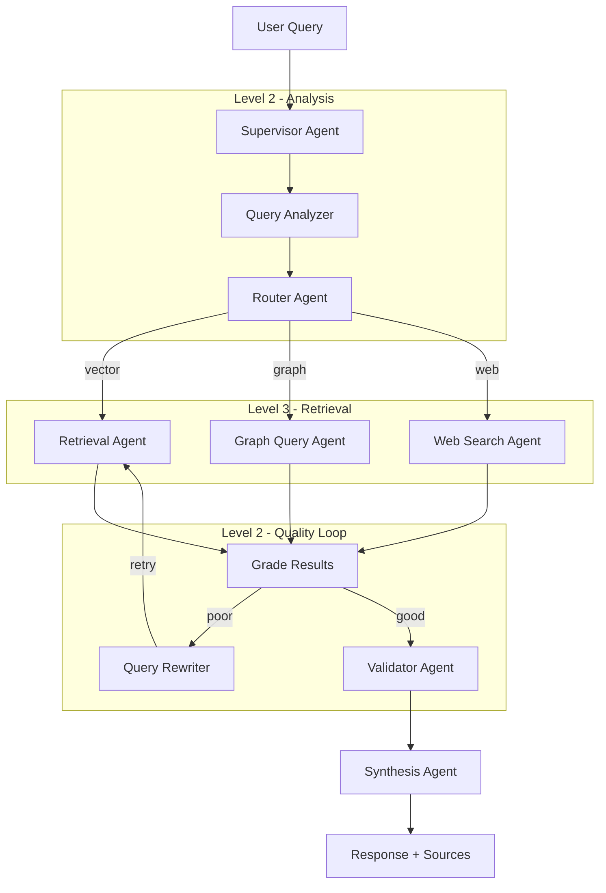

# Chorus: A Multi-Agent RAG System

> **Conversational AI with 8-agent hierarchical orchestration, GraphRAG knowledge graphs, and real-time WebSocket streaming**

[](https://www.python.org/downloads/)
[](https://aws.amazon.com/bedrock/)
[](https://langchain-ai.github.io/langgraph/)
[](https://qdrant.tech/)
[](https://opensource.org/licenses/MIT)

## Overview

An advanced Retrieval-Augmented Generation (RAG) system featuring 8 specialized AI agents orchestrated in a hierarchical architecture. Achieves **90%+ retrieval precision** on technical documentation with:

- **Query Rewrite Loop** for iterative precision improvement
- **Semantic Chunking** with Max-Min algorithm
- **Hybrid Search** (Vector + BM25 with RRF fusion)
- **Cross-Encoder Reranking** (BGE-Reranker-Large)


### Key Features

| Feature | Description |
|---------|-------------|
| 🎯 **8-Agent System** | Hierarchical orchestration with LangGraph |
| 🔄 **Query Rewrite Loop** | Grades results, rewrites queries for 90% precision |
| 🔍 **Hybrid Retrieval** | Vector (Qdrant) + BM25 + Neo4j GraphRAG |
| ⚡ **Real-time Streaming** | WebSocket with agent progress events |
| 🧠 **Conversation Memory** | Redis-backed multi-turn context |
| 📊 **RAG Evaluation** | Precision@K, MRR, Faithfulness metrics |
| ☁️ **Production Ready** | AWS EKS with Terraform IaC |

## Architecture



### Agent Hierarchy

| Level | Agent | Responsibility |
|-------|-------|----------------|
| L1 | Supervisor | Orchestrates workflow via LangGraph |
| L2 | Query Analyzer | Intent, entities, complexity analysis |
| L2 | Router | Strategy selection (vector/graph/web) |
| L2 | Query Rewriter | Grades results, rewrites poor queries |
| L2 | Validator | Fact-checking, hallucination detection |
| L2 | Synthesis | Response generation with citations |
| L3 | Retrieval | Hybrid search + reranking |
| L3 | Graph Query | Neo4j Cypher queries, path finding |
| L3 | Web Search | Tavily/SerpAPI real-time search |

## Quick Start

### Prerequisites

- Python 3.11+
- Docker & Docker Compose
- AWS Account (for Bedrock)
- 16GB RAM recommended

### Installation

```bash
# Clone and setup
git clone <your-repo-url>
cd multi-agent-rag

# Virtual environment
python -m venv venv
source venv/bin/activate  # Windows: venv\Scripts\activate

# Install dependencies
pip install poetry && poetry install

# Configure environment
cp .env.example .env
# Edit .env with your credentials
```

### Run Locally

```bash
# Start infrastructure
docker-compose up -d

# Ingest documents
python scripts/ingest_documents.py --source data/docs

# Start API
uvicorn src.api.main:app --reload --host 0.0.0.0 --port 8000

# Test endpoints
python examples/test_api.py
```

### WebSocket Chat

```python
import asyncio
import websockets
import json

async def chat():
    async with websockets.connect("ws://localhost:8000/api/v1/ws/chat") as ws:
        # Receive session
        session = await ws.recv()
        
        # Send message
        await ws.send(json.dumps({
            "type": "chat.message",
            "message": "How do I use LangGraph for multi-agent systems?"
        }))
        
        # Receive response
        response = await ws.recv()
        print(json.loads(response))

asyncio.run(chat())
```

## Project Structure

```
multi-agent-rag/
├── src/
│   ├── agents/           # 8 specialized agents + orchestrator
│   │   ├── supervisor_orchestrator.py  # LangGraph workflow
│   │   ├── query_analyzer.py
│   │   ├── router_agent.py
│   │   ├── query_rewriter.py    
│   │   ├── retrieval_agent.py
│   │   ├── graph_query_agent.py
│   │   ├── web_search_agent.py
│   │   ├── validation_agent.py
│   │   └── synthesis_agent.py
│   ├── retrieval/        # Search & reranking
│   │   ├── vector_store.py      # Qdrant client
│   │   ├── hybrid_search.py     # Vector + BM25 RRF
│   │   ├── semantic_chunker.py  # Max-Min chunking
│   │   ├── bge_reranker.py      # Cross-encoder
│   │   └── reranker.py
│   ├── graph/            # GraphRAG
│   │   ├── neo4j_client.py
│   │   ├── entity_extractor.py
│   │   └── cypher_generator.py
│   ├── evaluation/       # RAG metrics
│   │   └── rag_evaluator.py     # RAGAS-style evaluation
│   ├── memory/           # Conversation persistence
│   ├── api/              # FastAPI + WebSocket
│   ├── llm/              # Bedrock client
│   ├── tracing/          # LangSmith observability
│   └── services/         # Orchestrator service
├── infrastructure/
│   ├── terraform/        # AWS EKS IaC
│   └── kubernetes/       # K8s manifests
├── examples/             # Usage examples
├── scripts/              # Ingestion, deployment
└── docs/                 # Documentation
```

## Technology Stack

| Category | Technology |
|----------|------------|
| **LLM** | AWS Bedrock (Claude 4.5 Sonnet) |
| **Embeddings** | Amazon Titan Embeddings V2 |
| **Framework** | LangChain 0.3, LangGraph 0.2 |
| **Vector DB** | Qdrant (hybrid search) |
| **Graph DB** | Neo4j (GraphRAG) |
| **Cache/Memory** | Redis |
| **Reranking** | BGE-Reranker-Large, Cohere |
| **API** | FastAPI + WebSocket |
| **Deployment** | AWS EKS, Terraform |
| **Observability** | LangSmith, Prometheus |

## Documentation

| Document | Description |
|----------|-------------|
| [ARCHITECTURE.md](docs/ARCHITECTURE.md) | System design, diagrams, schemas |
| [SETUP.md](docs/SETUP.md) | Installation and configuration |
| [API.md](docs/API.md) | REST & WebSocket reference |

## Performance Targets

| Metric | Target | Method |
|--------|--------|--------|
| Precision@5 | ≥ 90% | Query rewrite + reranking |
| Recall@10 | ≥ 85% | Hybrid search |
| Latency (p95) | ≤ 3s | Parallel retrieval |
| Faithfulness | ≥ 95% | Validator agent |
| Hallucination | ≤ 2% | Source grounding |

## License

MIT License - see [LICENSE](LICENSE) for details.

## Acknowledgments

- [LangChain](https://langchain.com/) & [LangGraph](https://langchain-ai.github.io/langgraph/)
- [Qdrant](https://qdrant.tech/) & [Neo4j](https://neo4j.com/)
- [AWS Bedrock](https://aws.amazon.com/bedrock/)
- Research: NotebookLM findings on 90% precision RAG architectures
