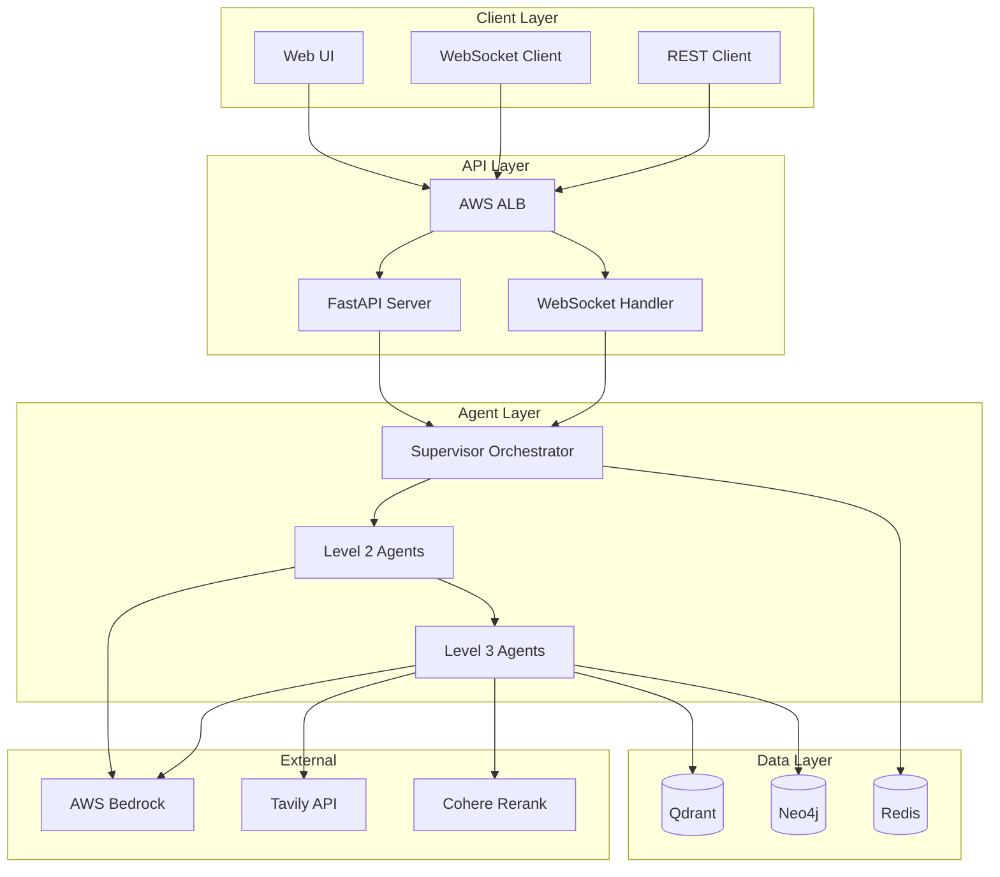
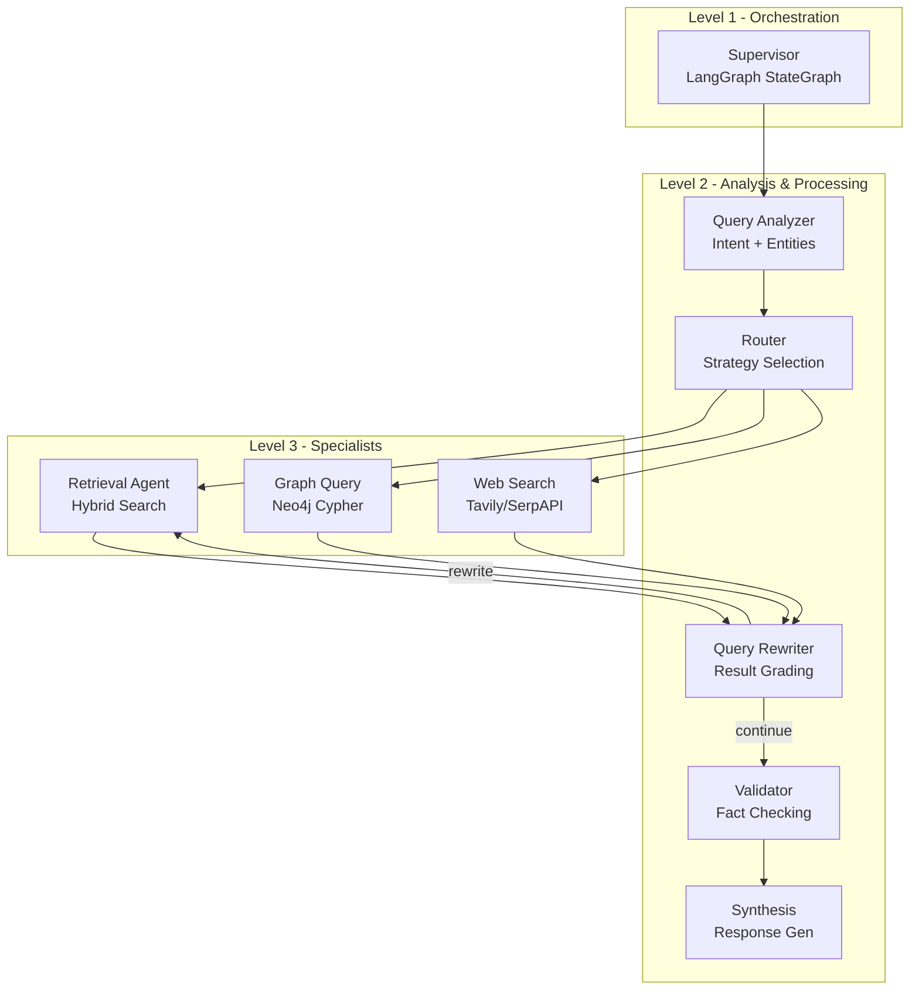
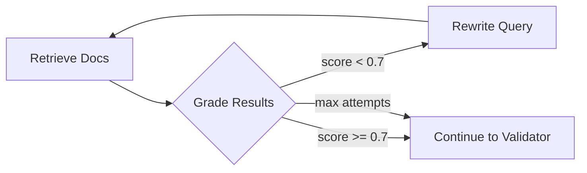
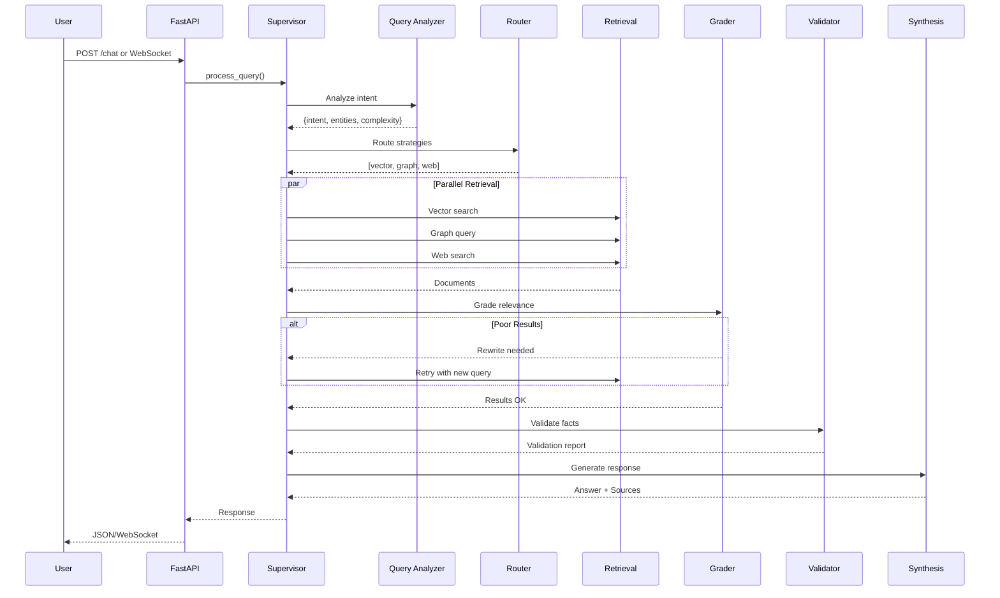
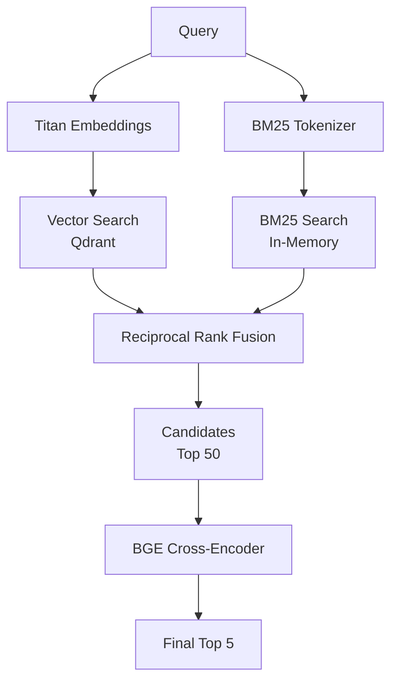
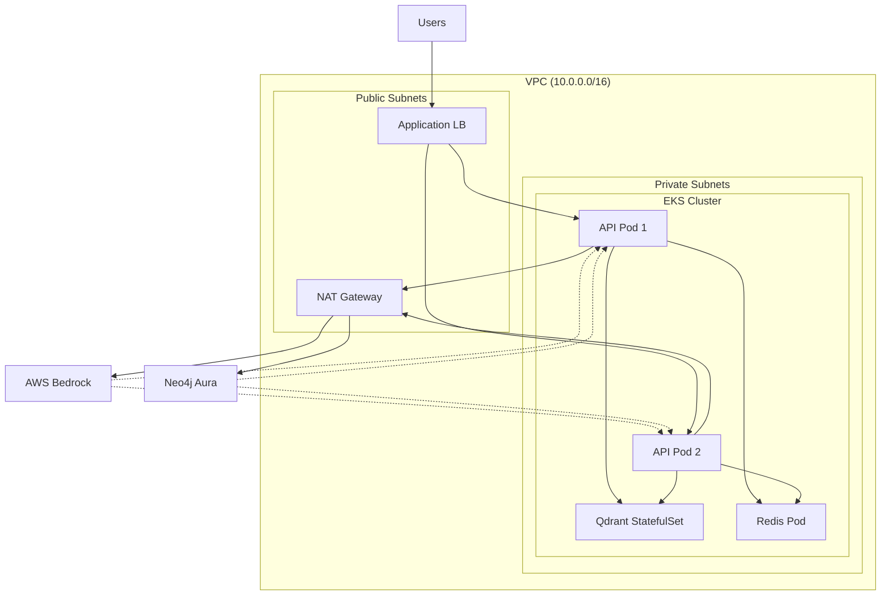

# Multi-Agent RAG System Architecture

> Comprehensive technical architecture documentation for the 8-agent hierarchical RAG system.

## Table of Contents

1. [System Overview](#system-overview)
2. [Agent Architecture](#agent-architecture)
3. [Data Flow](#data-flow)
4. [Database Schemas](#database-schemas)
5. [Retrieval Pipeline](#retrieval-pipeline)
6. [Deployment Architecture](#deployment-architecture)
7. [API Design](#api-design)

---

## System Overview

### High-Level Architecture



### Technology Matrix

| Component | Technology | Purpose |
|-----------|------------|---------|
| LLM | Claude 4.5 Sonnet (Bedrock) | Generation, analysis |
| Embeddings | Titan Embeddings V2 | Dense vectors |
| Orchestration | LangGraph StateGraph | Agent workflow |
| Vector Store | Qdrant | Semantic search |
| Graph Store | Neo4j | Entity relationships |
| Cache/Memory | Redis | Session state |
| API | FastAPI | REST + WebSocket |
| Reranking | BGE-Reranker-Large | Cross-encoder scoring |

---

## Agent Architecture

### Hierarchical Agent System



### Agent Specifications

#### Level 1: Supervisor Orchestrator

```python
# LangGraph Workflow Definition
workflow = StateGraph(AgentState)
workflow.add_node("supervisor", _supervisor_node)
workflow.add_node("query_analyzer", _query_analyzer_node)
workflow.add_node("router", _router_node)
workflow.add_node("multi_retrieval", _multi_retrieval_node)
workflow.add_node("grade_results", _grade_results_node)
workflow.add_node("rewrite_query", _rewrite_query_node)
workflow.add_node("validator", _validator_node)
workflow.add_node("synthesis", _synthesis_node)

# Conditional edges for query rewrite loop
workflow.add_conditional_edges(
    "grade_results",
    _should_rewrite,
    {"rewrite": "rewrite_query", "continue": "validator"}
)
```

#### Level 2: Query Analyzer

| Output Field | Type | Description |
|--------------|------|-------------|
| intent | string | factual_qa, comparison, explanation, etc. |
| entities | list[str] | Extracted technical terms |
| complexity | string | simple, moderate, multi_hop |
| time_sensitive | bool | Requires current information |
| requires_code | bool | Code examples needed |

#### Level 2: Router Agent

**Routing Decision Tree:**

```
IF entities > 1 AND complexity in (moderate, multi_hop):
    strategies = [graph, vector]
ELIF time_sensitive:
    strategies = [web, vector]
ELIF requires_code:
    strategies = [vector]
ELIF complexity == multi_hop:
    strategies = [vector, graph]
ELSE:
    strategies = [vector]
```

#### Level 2: Query Rewriter

**Query Rewrite Loop (Max 2 attempts):**



---

## Data Flow

### Query Processing Pipeline



### Agent State Schema

```python
class AgentState(TypedDict):
    # Core
    query: str
    original_query: str
    session_id: Optional[str]
    
    # Analysis
    analysis: Dict[str, Any]  # Query analyzer output
    strategies: List[str]     # Router decisions
    
    # Retrieval
    retrieved_documents: List[Dict]
    graph_results: Optional[Dict]
    web_results: Optional[Dict]
    
    # Quality Loop
    grading: Dict[str, Any]
    rewrite_count: int
    rewritten_query: Optional[str]
    
    # Validation
    validation: Dict[str, Any]
    confidence: float
    
    # Output
    response: str
    sources: List[Dict]
    agent_trace: List[str]
```

---

## Database Schemas

### Qdrant Vector Store

```yaml
Collection: documents
  Vectors:
    size: 1024  # Titan Embeddings V2
    distance: Cosine
    
  Payload Schema:
    - id: string (UUID)
    - text: string (chunk content)
    - doc_id: string (parent document)
    - chunk_index: int
    - cohesion_score: float (semantic chunker)
    - source_type: string (vector|graph|web)
    
  Indexes:
    - doc_id (keyword)
    - source_type (keyword)
    
  HNSW Config:
    m: 16
    ef_construct: 128
```

### Neo4j Graph Schema

```mermaid
erDiagram
    Module ||--o{ Class : CONTAINS
    Module ||--o{ Function : CONTAINS
    Class ||--o{ Function : CONTAINS
    Class ||--o{ Class : INHERITS
    Function ||--o{ Function : CALLS
    Function ||--o{ Class : RETURNS
    Class ||--o{ Concept : IMPLEMENTS
    Entity ||--o{ Entity : RELATED_TO
    Entity ||--o{ Entity : USES
    
    Module {
        string name PK
        string description
        string version
    }
    
    Class {
        string name PK
        string description
        string[] methods
        string[] attributes
    }
    
    Function {
        string name PK
        string description
        string[] parameters
        string returns
    }
    
    Concept {
        string name PK
        string description
        string category
    }
    
    API {
        string name PK
        string endpoint
        string method
        string description
    }
```

**Neo4j Indexes:**
```cypher
CREATE INDEX FOR (n:Module) ON (n.name);
CREATE INDEX FOR (n:Class) ON (n.name);
CREATE INDEX FOR (n:Function) ON (n.name);
CREATE INDEX FOR (n:Concept) ON (n.name);
CREATE INDEX FOR (n:API) ON (n.name);
```

### Redis Memory Schema

```yaml
Keys:
  conversation:{session_id}:
    type: LIST
    ttl: 86400 (24h)
    format: JSON messages
    
  Message Format:
    - role: string (user|assistant)
    - content: string
    - timestamp: ISO8601
    - metadata: object
    
Commands:
  - RPUSH: Add message
  - LRANGE: Get history
  - LTRIM: Limit to N messages
  - EXPIRE: Set TTL
```

---

## Retrieval Pipeline

### Hybrid Search Architecture



### Semantic Chunking (Max-Min Algorithm)

```python
# 1. Embed all sentences
embeddings = await embed_sentences(sentences)

# 2. Cluster by similarity
for sentence in sentences[1:]:
    max_sim = max(cos_sim(sentence, chunk) for chunk in current_chunk)
    
    if max_sim >= threshold and len(chunk) < max_size:
        # Merge into current chunk
        current_chunk.append(sentence)
    else:
        # Start new chunk
        chunks.append(current_chunk)
        current_chunk = [sentence]

# 3. Calculate cohesion scores
for chunk in chunks:
    chunk.cohesion = mean(pairwise_similarities(chunk))
```

### Reranking Strategy

| Stage | Model | Candidates | Output |
|-------|-------|------------|--------|
| 1. Initial | Bi-encoder | All docs | Top 50 |
| 2. Rerank | BGE Cross-encoder | Top 50 | Top 5 |
| 3. Fallback | Cohere API | (if BGE fails) | Top 5 |

---

## Deployment Architecture

### AWS EKS Topology



### Kubernetes Resources

| Resource | Replicas | CPU | Memory |
|----------|----------|-----|--------|
| API Deployment | 2-10 (HPA) | 250m-1000m | 512Mi-2Gi |
| Qdrant StatefulSet | 1 | 500m-2000m | 1Gi-4Gi |
| Redis Deployment | 1 | 100m-500m | 256Mi-1Gi |

### Horizontal Pod Autoscaler

```yaml
metrics:
  - cpu: 70% target
  - memory: 80% target
behavior:
  scaleUp:
    stabilizationWindow: 60s
    maxPods: 2 per 60s
  scaleDown:
    stabilizationWindow: 300s
    maxPods: 1 per 120s
```

---

## API Design

### REST Endpoints

| Method | Endpoint | Description |
|--------|----------|-------------|
| POST | `/api/v1/chat` | Synchronous query |
| POST | `/api/v1/docs/upload` | Document ingestion |
| GET | `/api/v1/docs/search` | Direct vector search |
| GET | `/api/v1/health` | Health check |
| GET | `/api/v1/health/detailed` | Component status |

### WebSocket Protocol

```json
// Client → Server
{"type": "chat.message", "session_id": "...", "message": "..."}

// Server → Client (progress)
{"type": "agent.thinking", "agent": "query_analyzer", "message": "..."}
{"type": "retrieval.progress", "count": 5}

// Server → Client (response)
{
  "type": "message.complete",
  "answer": "...",
  "sources": [...],
  "metadata": {
    "agent_trace": ["supervisor", "query_analyzer", ...],
    "confidence": 0.92
  }
}
```

---

## Evaluation Metrics

### RAG Quality Metrics

| Metric | Formula | Target |
|--------|---------|--------|
| Precision@K | relevant_in_topK / K | ≥ 0.90 |
| Recall@K | relevant_in_topK / total_relevant | ≥ 0.85 |
| MRR | 1 / first_relevant_rank | ≥ 0.80 |
| Faithfulness | LLM-judge grounding score | ≥ 0.95 |
| Answer Relevancy | LLM-judge query match | ≥ 0.90 |

### Evaluation Pipeline

```python
result = await rag_evaluator.evaluate(
    query="How does LangGraph handle state?",
    answer=generated_answer,
    retrieved_docs=docs,
    relevant_doc_ids=ground_truth_ids,
)

# Returns: precision@5, recall@10, mrr, faithfulness, answer_relevancy
```

---

## Security Considerations

1. **API Authentication**: JWT tokens via AWS Cognito
2. **Secrets Management**: Kubernetes Secrets + AWS Secrets Manager
3. **Network Policy**: Ingress/Egress rules per namespace
4. **RBAC**: Qdrant metadata filtering for multi-tenancy
5. **Data Encryption**: TLS in transit, EBS encryption at rest
